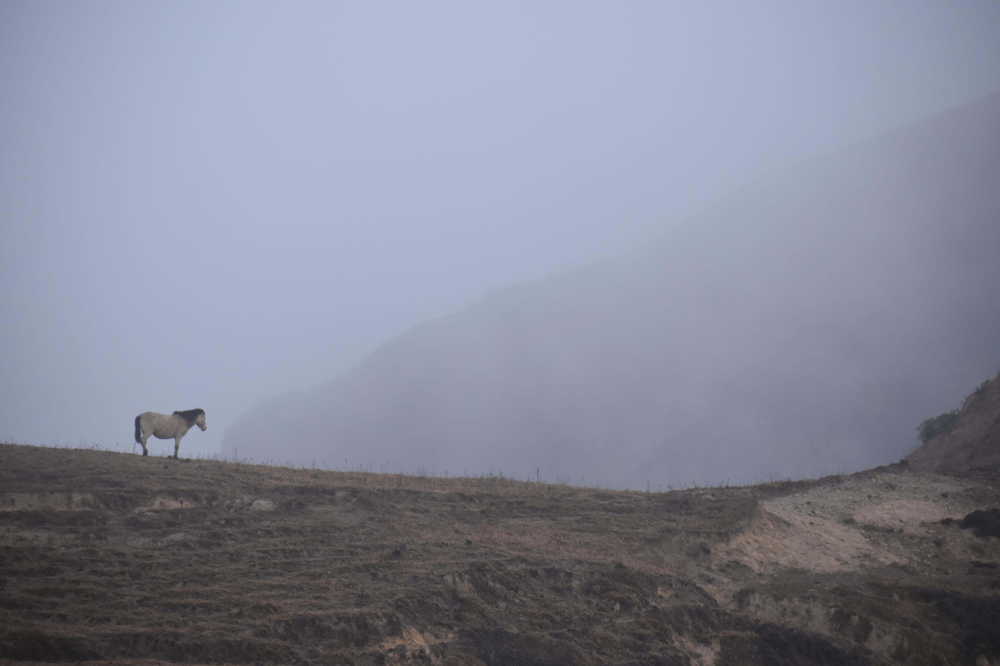
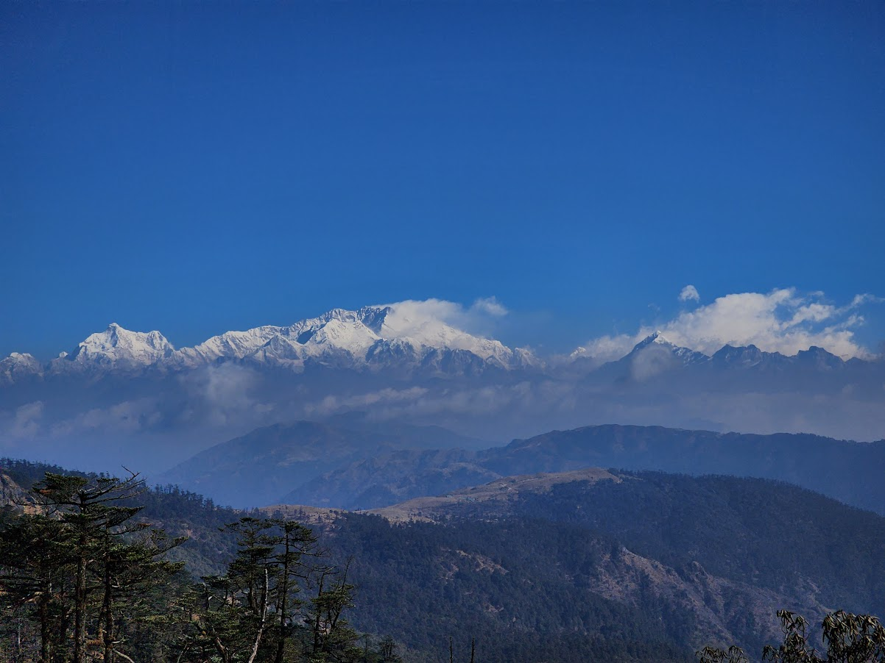
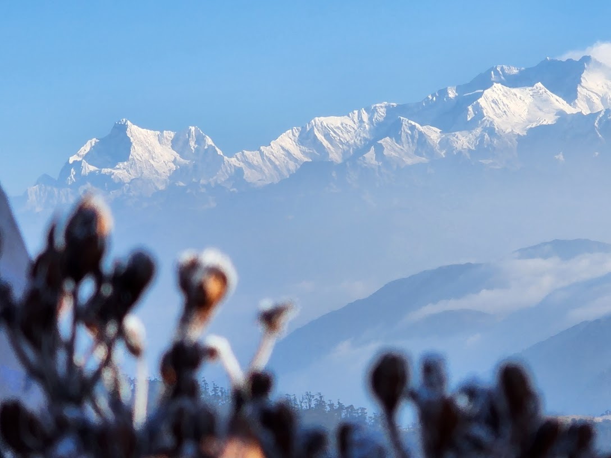
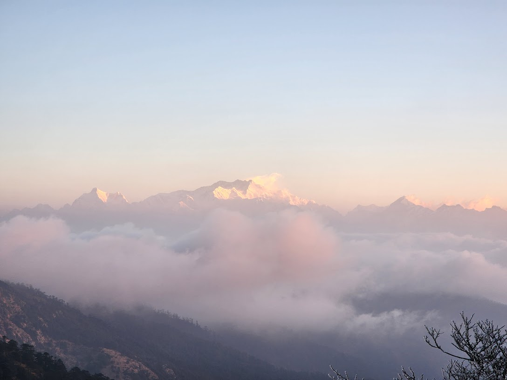
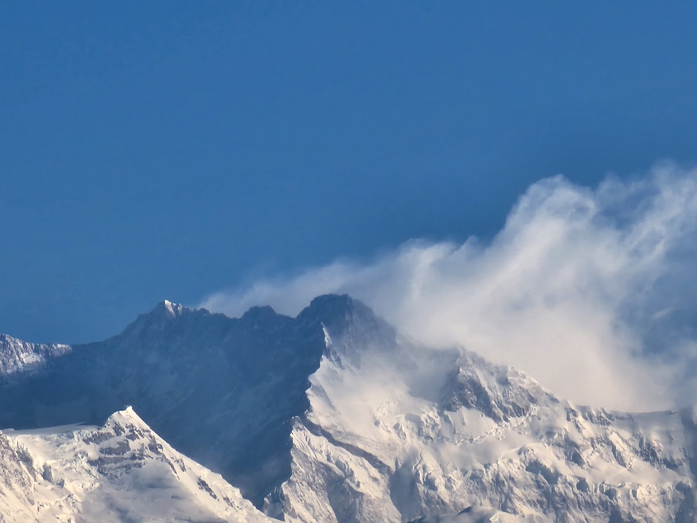
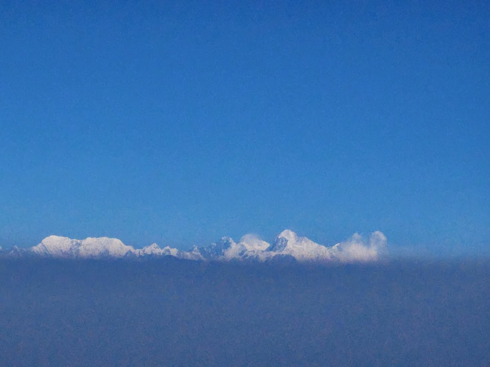

I trekked Sandakphu-Phalut during February '22. We were unlucky as the clouds hid the view of the peak Kanchenchunjga from the closest point on the trek-Phalut. The next night heavy winds cleared the clouds and we saw the peaks from Aal. 

		

			
			
Horse

	  

    

			
			
Horse

	  

    

			
			
Yak

	  

    

			
			
Sleeping Buddha, Mt. Kanchenjunga

	  

    

			
			

	  

    

			
			
Alpenglow

	  

    

			
			
Power of high power camera

	  

    

			
			
Peaks Everest, Ama Dablam, Lhotse

	  

    <!-- 

			
			
This is me

		
 -->

<figure>
  
  <figcaption>This is me</figcaption>
</figure> 
    