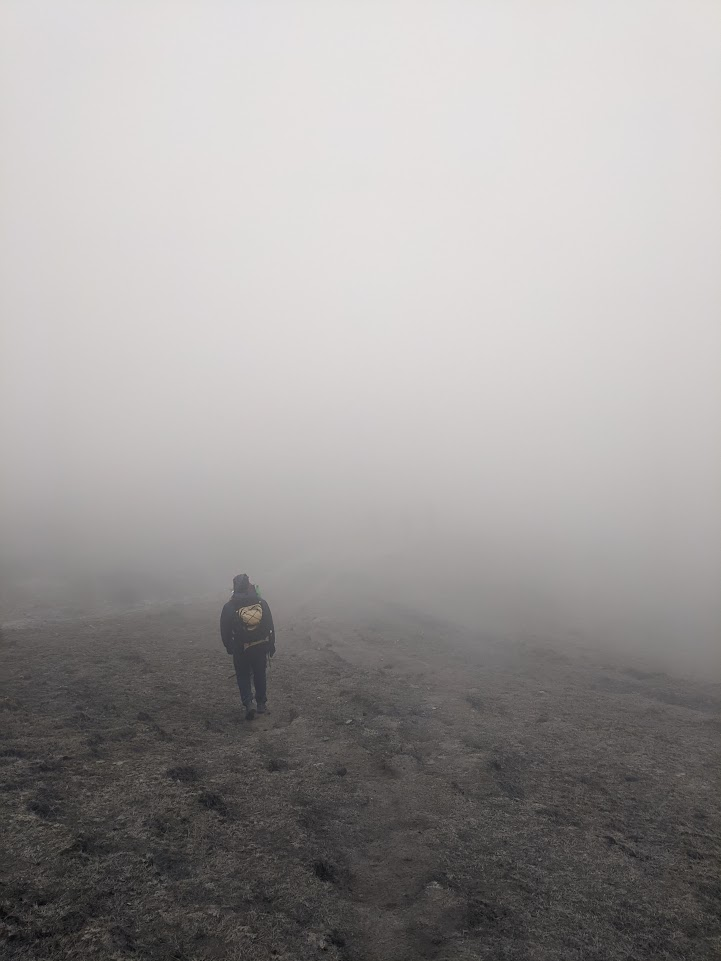

I don't have much going on that's not math. Hopefully I find something interesting to fill this page.

"We are plain quiet folk and have no use for adventures. Nasty disturbing uncomfortable things! Make you late for dinner! I can't think what anybody sees in them."

<!-- 
  <h4>
    <a href="{{ project.url }}">
      {{ project.title }}
    </a>
  </h4> 
  
{{ project.description }}

  

 -->

Here is a picture of me from my trek to Sandakphu-Phalut. I will upload more pictures soon. I got to see the peaks Kanchenjunga, Everest, Ama Dablam, Lhotse from Aal. 
    <figure>
      
      <figcaption>This is me</figcaption>
    </figure>
    <figure>
      
     <figcaption>Horse on Hill</figcaption>
    </figure>

<!-- [Trek]({{ site.url }}/projects1/trek){:target="_blank"} 
 -->